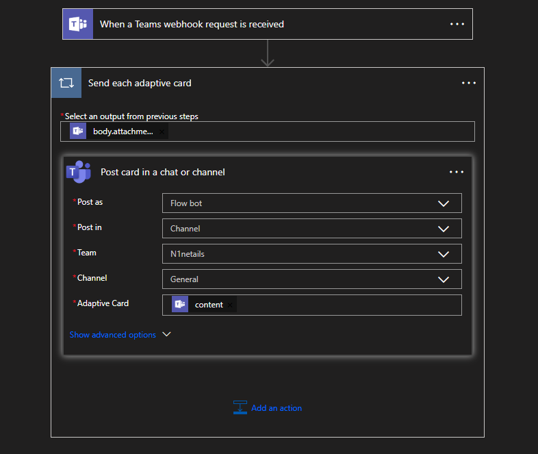

# N1netails

<div align="center">
  
</div>

[](LICENSE)


# Teams Webhook Client
N1netails is an open-source project that provides practical alerts and monitoring for applications.
Use the N1netails Teams Webhook Client to easily send webhook messages to a teams channel.

## How to set up a team and channels
In order to use this webhook client you will need to have a Microsoft 365 Business account.

### Create teams webhook

1. In Microsoft Teams, choose a channel and from the options menu (...) select **Workflows**.
2. Search for **Send webhook alerts to a channel** and select it.
3. Provide a name for your new webhook select **Next**.
4. In the details section select the **Microsoft Teams Team** and the **Microsoft Teams Channel** you want the webhook to be linked to select **Add Workflow**.
4. The dialog will present a unique URL that maps to the channel. Copy this **webhook URL**.
5. Your webhook is now ready to receive messages.

### Editing a Webhook in Power Automate
You can confirm your workflow is set up correctly by going to the channel where the workflow is installed.

1. Click on **More Options** it will be three dots '...' next to the channel when you hover over it.
2. Select **Workflows**.
3. Click **Manage** in the bottom-left corner.
4. Hover over your target webhook and select **More commands → Edit**.

If configured correctly, it should look like the image below:

<div align="center">
  
</div>

## Install
Install the teams webhook client by adding the following dependency:
```xml
<dependency>
    <groupId>com.n1netails</groupId>
    <artifactId>n1netails-teams-webhook-client</artifactId>
    <version>0.2.0</version>
</dependency>
```

Gradle (Groovy)
```groovy
implementation 'com.n1netails:n1netails-teams-webhook-client:0.2.0'
```

## Usage
To send a message to your Teams channel, use the `TeamsWebhookClient`.

```java
import com.n1netails.n1netails.teams.api.TeamsWebhookClient;
import com.n1netails.n1netails.teams.internal.TeamsWebhookClientImpl;
import com.n1netails.n1netails.teams.model.WebhookMessage;
import com.n1netails.n1netails.teams.service.WebhookService;

public class Example {
    public static void main(String[] args) {
        try {
            WebhookService webhookService = new WebhookService();
            TeamsWebhookClient client = new TeamsWebhookClientImpl(webhookService);

            WebhookMessage message = new WebhookMessage();
            message.setContent("Hello, from n1netails-teams-webhook-client!");

            client.sendMessage("YOUR_WEBHOOK_URL", message);
        } catch (Exception e) {
            e.printStackTrace();
        }
    }
}
```

# Develop
## Build
Build the project using the following command
```bash
mvn clean install
```

## Maven Central Repository
Use the following doc to get setup with publishing to the maven central repository
https://central.sonatype.org/register/central-portal/#publishing

Maven install using release profile.
```bash
mvn clean install -P release
```

Maven deploy to the maven central repository
```bash
mvn deploy -P release
```

## Support

For community users, open an issue on GitHub or Join our Discord

[](https://discord.gg/ma9CCw7F2x)

## Contributing

Please use the following guidelines for contributions [CONTRIBUTING](./contributing.md)